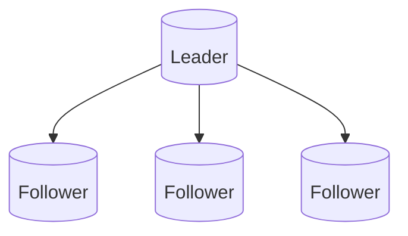
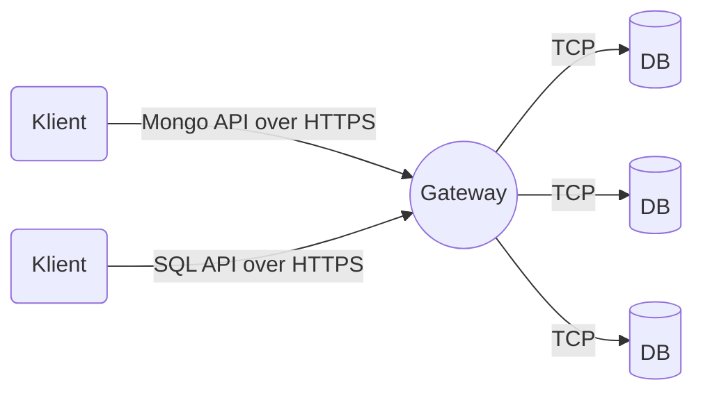
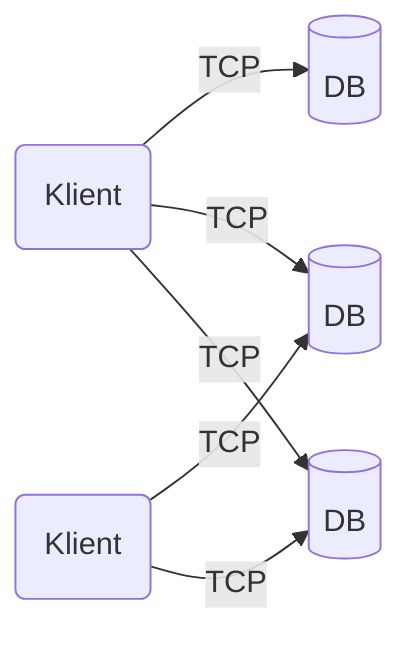

[[Update Conference 2021]]
### Cosmos DB
Cosmos DB er en NoSql implementasjon av Microsoft. Man kjører det vanligvis i Azure, men man kan også kjøre en CosmosDB emulator på sin egen maskin eller i et datacenter. Det finnes bl.a. et docker bilde.

Det finnes to typer partisjoneringer: Physical partitions, logical partitions. 
Physical er den faktisk databaseservere, logical er kontainere som er inndelt innad i en "fysisk" server. 
Henger ikke helt med på disse konseptene, må undersøke nærmere. 

Strukturen er ca. slik

Cosmos tilbyr også en rekke forskjellige protokoller for å snakke med databasen: Cassandra, Mongo, SQL, Gremlin og Table. SQL er den som er maintainet av Microsoft og er derfor den som får den siste funksjonaliteten først. 

Cosmos DB tilbyr 3 moduser
**Gateway Mode**

Denne legger selve database koplingen bak en brannmur og manager hvilke partisjoner man vil snakke med osv. Enklest å bruke.  

**Direct Mode**

Om man ønske mer kontroll og enda raskere kommunikasjon (et mindre hopp å gjøre). 

**Direct Gateway**
Kom nylig, for noen uker siden. Ser likt ut som gateway mode men er dyrere og skal visstnok gi noen ekstra feature som f.eks. muligheten til å cache resultater i gatewayen. 

Partition Key er det som bestemmer hvilken container hvert objekt skal i. Hver kontainer er en "bucket" med en hash, så jo flere ting man har i hver kontainer, jo lengre tid vil det ta å finne dem, da man da må loope gjennom alle objektene som er i kontaineren.