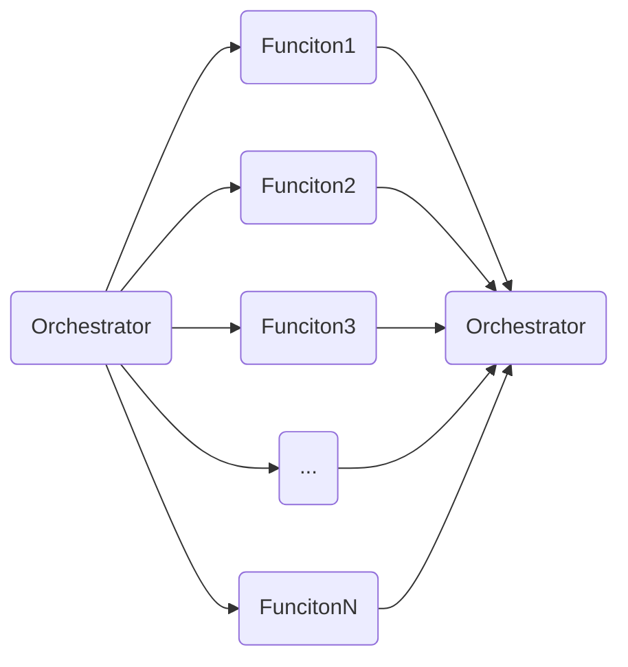

[[Update Conference 2021]]
### Function orchestration
* Av [Daron Yondem](https://daron.me/)
	* [Slidedecks](https://daron.me/decks) 
* Man kan orkestrere en "flåte" av funksjoner på 2 måter, [[Logic Apps]] og [[Durable Functions]]. 
* Om du skal kalle f.eks. 10 funksjoner for å resize bilder, bruk fan out/fan in mønsteret. 
IKKE GJØR DETTE:
 ```csharp
			list.Add(await InvokeFunction("Resize"))
			list.Add(await InvokeFunction("Resize"))
			list.Add(await InvokeFunction("Resize"))
```
	
Gjør Dette
```csharp
			list.Add(InvokeFunction("Resize"))
			list.Add(InvokeFunction("Resize"))
			await Task.WhenAll(list);
```
			
Dette vil føre til at man kjører alle disse funksjonene i paralell, og siden dette er azure funksjoner så kan vi i praksis kjøre tusenvis av slike prosesser i parrallel. Dette er FanOut/FanIn
